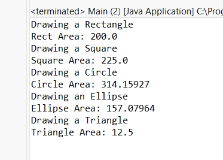

🧩 **Shape Drawing System**
``` This Java application demonstrates object-oriented design principles by modeling a geometric shape system using inheritance, interfaces, and abstract classes.```


📁 **Project Structure**
ShapeDrawingSystem/
├── src/
│   └── shapes/
│       ├── Shape.java
│       ├── ClosedShape.java
│       ├── Movable.java
│       ├── Point.java
│       ├── Line.java
│       ├── Color.java
│       ├── Rectangle.java
│       ├── Square.java
│       ├── Circle.java
│       ├── Ellipse.java
│       ├── Triangle.java
│       ├── Polygon.java
│       └── Main.java


🚀 **Features**
- ✅ Clean code with proper naming conventions
- ✅ Shape hierarchy using abstract base classes
- ✅ Factory methods for shape creation
- ✅ Movable interface with movement logic
- ✅ getArea() and getPerimeter() implemented polymorphically
- ✅ Handles Circle-Ellipse and Square-Rectangle design properly


🛠️ **How to Run**
- Open the project in Eclipse
- Right-click Main.java → Run As → Java Application
- You’ll see output in the console like:



🧠 **OOP Concepts Used**
- Inheritance (Shape, ClosedShape)
- Abstract Classes (Shape)
- Polymorphism (draw(), getArea())
- Encapsulation (via getters/setters)
- Interfaces (Movable)
- Factory Methods (createRectangle, createCircle, etc.)


💡 **Design Decisions**
Circle and Square do not inherit from Ellipse or Rectangle respectively to avoid Liskov Substitution Principle violations.
getArea() is centralized in ClosedShape to avoid redundancy.


📌 **Requirements Covered**
 - Java code conventions followed
 - Setters and getters implemented
 - Factory methods used for object creation
 - Interface (Movable) implemented properly
 - All shape types supported: Rectangle, Square, Circle, Ellipse, Triangle, Polygon


👨‍💻 **Author**
Alaa Odeh
Java OOP Project – 2025
